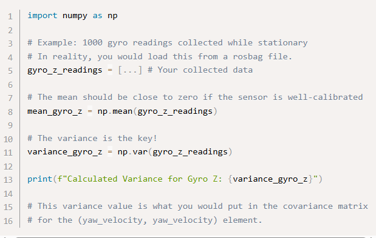

**ROS2 Localization မှ Covariance Matrix အကြောင်း**

**ROS 2 Localization** (ယေဘုယျအားဖြင့်
စာရင်းအင်းပညာရပ်တွင်ဖော်ပြလေ့ရှိသော) ရှိ **covariance matrix** ဆိုသည်မှာ
ပြောင်းလဲနိုင်သောအရာ (variables) အစုတစ်ခု၏ **မသေချာမရေရာမှု
(uncertainty)** နှင့် **အချင်းချင်းမှီခိုဆက်စပ်မှု (interdependencies)**
များကို ပမာဏအားဖြင့် ဖော်ပြခြင်းဖြစ်သည်။ စက်ရုပ်တစ်ခုက ပတ်ဝန်းကျင်အတွင်း
လမ်းကြောင်းရှာဖွေသည့် အခြေအနေတွင်၊ အပြောင်းအလဲဖြစ်နိုင်သောအရာများသည်
၎င်း၏အနေအထား (pose) တစ်နည်းပြောရရင် ၎င်း၏ 3D နေရာချထားမှု(position) (x,
y, z) နှင့် ၎င်း၏ 3D ဦးတည်ချက် (orientation) (roll, pitch, yaw) -- ကို
ပုံမှန်အားဖြင့် ကိုယ်စားပြုသည်။

သင့်စက်ရုပ်၏ အာရုံခံကိရိယာများ (IMUs, LiDAR, ကင်မရာများ၊ GPS) သည်
ပြီးပြည့်စုံမှုမရှိပါ။ ၎င်းတို့သည် ခန့်မှန်းချက်များကို ပေးစွမ်းပြီး၊
ဤခန့်မှန်းချက်များသည် **ယုံမှားသံသယ** တစ်ခုပါရှိသည်။ Covariance matrix
သည် ဤသံသယကို ကိုယ်စားပြုရန်အတွက် ကျစ်လျစ်သော ခန်မှန်းချက်ပြ
နည်းလမ်းတစ်ခုဖြစ်သည်။

**nav_msgs/msg/Odometry** သို့မဟုတ်
**geometry_msgs/msg/PoseWithCovariance** ကဲ့သို့သော ROS 2
မက်ဆေ့ချ်များတွင်၊ ဤ covariance ကို **6x6 matrix** (အကန့် ၃၆ ခုပါဝင်သော
array တစ်ခု) အဖြစ် ပုံမှန်အားဖြင့် တွေ့ရပါမည်။ ၎င်းသည် အောက်တွင်
ဖော်ပြထားသော Degree of Freedom (DOF) ၆ ခုနှင့် ဆက်စပ်နေသောကြောင့်
ဖြစ်သည်။

-   **နေရာချထားမှု (Position):** x, y, z

-   **ဦးတည်ချက် (Orientation):** roll, pitch, yaw

**6x6 Covariance Matrix အကြောင်း**

၆×၆ covariance matrix ၏ အတန်းများနှင့် ကော်လံများ ကို စက်ရုပ် ၏ အနေအထား
(pose) ပြောင်းလဲနိုင်သောအရာများဖြစ်သည့် **\[x, y, z, roll, pitch,
yaw\]** နှင့် အစားသွင်း သတ်မှတ် မယ် ဆိုရင် ခုလို မြင်ရမှာ ဖြစ်ပါတယ်။

ထောင့်ဖြတ် အစိတ်အပိုင်းများ (Diagonal Elements) or variances (ဥပမာ- cxx,
cyy, cθθ)

Cxx သည် စက်ရုပ်၏ x-နေရာချထားမှုရှိ မတူကွဲပြားမှုကို ကိုယ်စားပြုသည်။
တန်ဖိုးသေးငယ်ခြင်းက စက်ရုပ်သည် ၎င်း၏ x-သြဒိနိတ် (coordinate) နှင့်
ပတ်သက်၍ ပိုမိုသေချာကြောင်း ဆိုလိုသည်။ တန်ဖိုးပိုကြီးခြင်းက
ပိုမိုမသေချာမှုရှိကြောင်း ပြသသည်။

အလားတူပင်၊ Cyy သည် y-ရှိ မတူကွဲပြားမှုဖြစ်ပြီး၊ Czz သည် z-ရှိ
မတူကွဲပြားမှုဖြစ်သည်။

**Crr** (မကြာခဏ C(roll,roll) အဖြစ် သတ်မှတ်သည်)၊ **Cpp** (C(pitch,pitch))
နှင့် cθθ (C(yaw,yaw)) တို့သည် roll, pitch, နှင့် yaw ဦးတည်ချက်များရှိ
မတူကွဲပြားမှုများကို အသီးသီးကိုယ်စားပြုသည်။ ထပ်မံ၍ တန်ဖိုးသေးငယ်ခြင်းက
ပိုမိုသေချာကြောင်း ဆိုလိုသည်။

ထောင့်ဖြတ်မဟုတ်သော အစိတ်အပိုင်းများ (Off-Diagonal Elements) or
covariances (ဥပမာ cxy, cxθ)

covariances တို့သည် မတူညီသော Degree of Freedom **နှစ်ခုကြားရှိ
ဆက်နွယ်မှုကို** ဖော်ပြသည်။

**positive covariance** (Cxy \> 0) သည် x ၏ ခန့်မှန်းတန်ဖိုးသည်
မှန်ကန်သောတန်ဖိုးထက် ပိုမြင့်ပါက၊ y ၏ ခန့်မှန်းတန်ဖိုးသည်လည်း
ပိုမိုမြင့်မားနိုင်သည် (နှင့် အပြန်အလှန် သဘောအားဖြင့် yများရင်
xလည်းများ)သည် ကို ဆိုလိုသည်။ ၎င်းတို့သည် **အမှားအယွင်းများ တူညီသော
ဦးတည်ချက်သို့ သွားလေ့ရှိသည်။ (direct proportion)**

**negative covariance** (Cxy\<0) သည် x ၏ ခန့်မှန်းတန်ဖိုးသည်
ပိုမြင့်ပါက၊ y ၏ ခန့်မှန်းတန်ဖိုးသည် ပိုမိုနိမ့်ကျနိုင်သည်ကို ဆိုလိုသည်။
၎င်းတို့သည် **ဆန့်ကျင်ဘက် ဦးတည်ချက်သို့ အမှားအယွင်းများ သွားလေ့ရှိသည်။
(indirect proportion)**

**zero covariance** (cxy≈0) သည် x နှင့် y ရှိ မသေချာမှုများသည်
များစွာအားဖြင့် **တစ်ဦးနှင့်တစ်ဦး လွတ်လပ်သည်** ကို အကြံပြုသည်။ x ရှိ
အမှားအယွင်းတစ်ခုသည် y ရှိ ဖြစ်နိုင်ချေရှိသော အမှားအယွင်းနှင့် ပတ်သက်၍
သင့်အား များစွာမပြောပြနိုင်ပါ။ (there is no co-relation between x and y)

ဥပမာအားဖြင့်၊ **C(x ,yaw)** သည် စက်ရုပ်၏ x-နေရာချထားမှုရှိ
မသေချာမှုနှင့် ၎င်း၏ yaw ဦးတည်ချက်ရှိ မသေချာမှုကြားရှိ ဆက်နွယ်မှုကို
ဖော်ပြပါလိမ့်မည်။ ၎င်းသည် အရေးပါနိုင်သည်။ စင်္ကြံလမ်းတစ်ခုအတိုင်း
ရွေ့လျားနေသော စက်ရုပ်ကို စဉ်းစားကြည့်ပါ။ ၎င်း၏ yaw (ဦးတည်ချက်) ရှိ
အမှားအယွင်းတစ်ခုသည် ၎င်း၏ ဒေါင်လိုက် နေရာချထားမှု (ဥပမာ- x သည်
forwardဖြစ်ပါက y-နေရာချထားမှု) တွင် အမှားအယွင်း တိုးလာစေနိုင်သည်။

Covariance တွေရဲ့ ပထမ ဆုံး တန်ဖိုး ကို ဘယ်လိုသတ်မှတ်မလဲ

**ဒေတာစာရွက်ကို ပိုင်းခြားစိတ်ဖြာခြင်း (datasheet analysis)**၊
**လက်တွေ့စမ်းသပ်မှုများ (empirical testing)** နှင့် **အချက်အလက်အခြေခံ
ညှိယူခြင်း (educated tuning)** တို့၏ ပေါင်းစပ်မှုဖြစ်ပါတယ်။(survey
ကောက်သလိုပေါ့ ) ရည်မှန်းချက်ကတော့ သင့်အာရုံခံကိရိယာ၏ ဆူညံသံ (noise)
နှင့် မသေချာမှု (uncertainty) ကို လက်တွေ့ကျပြီး ပမာဏအားဖြင့်
တိုင်းတာနိုင်သည့် တန်ဖိုးတစ်ခု ပေးရန်ပင် ဖြစ်သည်။

Step-by-Step Guide

**အာရုံခံကိရိယာကို သီးခြားထားပါ (Isolate the Sensor):** သင့်စက်ရုပ်ကို
မျက်နှာပြင်ပြန့်ပေါ်တွင် လုံးဝငြိမ်သက်စွာ ထားရှိပါ။

**ဒေတာစုဆောင်းပါ (Collect Data):** အာရုံခံကိရိယာမှ ထွက်ပေါ်လာသော
မူရင်းဒေတာများကို မိနစ်အနည်းငယ်ကြာ မှတ်တမ်းတင်ပါ။ IMU တစ်ခုအတွက်ဆိုလျှင်
မက်ဆေ့ချ် (messages) ထောင်ပေါင်းများစွာကို စုဆောင်းနိုင်ပါသည်။ GPS
အတွက်ဆိုလျှင် မက်ဆေ့ချ် ရာဂဏန်းမျှပင် လုံလောက်နိုင်သည်။

**မတူကွဲပြားမှုကို တွက်ချက်ပါ (Calculate the Variance):** အာရုံခံကိရိယာ၏
မက်ဆေ့ချ်ရှိ ပြောင်းလဲနိုင်သောအရာ (variable) တစ်ခုစီအတွက်
မတူကွဲပြားမှုကို တွက်ချက်ရန် ရိုးရှင်းသော script တစ်ခု (NumPy ပါသော
Python သည် ဤအတွက် အကောင်းဆုံးဖြစ်သည်) ကို အသုံးပြုပါ။

ဥပမာအားဖြင့်၊ သင့် IMU အတွက်၊ X, Y, Z တို့ပတ်လည်ရှိ angular velocity
(ထောင့်အလျင်) နှင့် X, Y, Z တို့အတွက် linear acceleration
(တည့်တိုးအလျင်) အတွက် တိုင်းတာမှုများစွာ ရှိပါမည်။

ဤဒေတာစီးကြောင်းတစ်ခုချင်းစီအတွက် မတူကွဲပြားမှုကို သီးခြားတွက်ချက်ပါ။
(independent ဖြစ်ခြင်း)

ဤတွက်ချက်ရရှိသည့် မတူကွဲပြားမှု တန်ဖိုးသည် သင့် covariance matrix ၏
**ထောင့်ဖြတ်အပေါ်တွင် သင်ထည့်သွင်းမည့် တန်ဖိုးများ** ဖြစ်ပါသည်။

Example with Python

Let's say you collected 1000 IMU angular velocity Z-axis readings
(gyro_z) while the robot was still.

What about off diagonals ?

အစောပိုင်း လက်တွေ့တိုင်းတာမှု (empirical measurement) အတွက်၊
**ထောင့်ဖြတ်မဟုတ်သော အစိတ်အပိုင်းများသည် သုညဖြစ်သည်ဟု သင်ယူဆနိုင်သည်**။
၎င်းသည် ပြောင်းလဲနိုင်သောအရာများကြားရှိ ဆူညံသံ (noise) များသည်
ဆက်စပ်မှုမရှိ (uncorrelated) ဟု သင်ယူဆခြင်းကို ဆိုလိုသည်။ (ဥပမာအားဖြင့်၊
X-အရှိန် (acceleration) တိုင်းတာမှုရှိ ဆူညံသံသည် Y-အရှိန် တိုင်းတာမှုရှိ
ဆူညံသံနှင့် မသက်ဆိုင် ပါ) (Independent ဖြစ်ခြင်း)။

ဤယူဆချက်သည် အလွန်အဖြစ်များပြီး လက်ခံနိုင်သော **starting point** တစ်ခု
ဖြစ်ပါသည်။

**📄 ဒေတာစာရွက် နည်းလမ်း (The Datasheet Method)**

အရည်အသွေးမြင့် အာရုံခံကိရိယာအချို့၊ အထူးသဖြင့် **IMU များ** သည်
၎င်းတို့၏ ဆူညံသံစရိုက်လက္ခဏာ (noise characteristics) များကို ၎င်းတို့၏
ဒေတာစာရွက် (datasheets) များတွင် ဖော်ပြပေးလေ့ရှိသည်။ အောက်ပါ
စကားလုံးများကို ရှာဖွေကြည့်ပါ-

-   **ဆူညံသံသိပ်သည်းဆ (Noise Density):** မကြာခဏဆိုသလို rad/s/Hz​
    သို့မဟုတ် m/s2/Hz ကဲ့သို့သော ယူနစ်များဖြင့် ဖော်ပြထားသည်။ ၎င်းကို
    မတူကွဲပြားမှု (variance) အဖြစ် ပြောင်းလဲရန်အတွက်၊ ထိုတန်ဖိုးကို
    နှစ်ထပ်ကိန်းပြုလုပ်ပြီး အာရုံခံကိရိယာ၏ ထုတ်ပေးဒေတာနှုန်း (Update
    Rate) (Hz ဖြင့်) နှင့် မြှောက်ရန်လိုအပ်သည်။

> Variance = (NoiseDensity)\^2×(UpdateRate)

-   **ကျပန်းလမ်းလျှောက်ခြင်း (Random Walk):** အချိန်ကြာလာသည်နှင့်အမျှ
    ဘက်လိုက်မှု (bias) သည် မည်သို့ပြောင်းလဲသွားသည်ကို ဖော်ပြသည်။

ဤနည်းလမ်းသည် ပိုမိုမြန်ဆန်သော်လည်း တိကျမှု နည်းပါးနိုင်သည်။
အဘယ်ကြောင့်ဆိုသော် ဒေတာစာရွက်ပါ တန်ဖိုးများသည်
စံပြဓာတ်ခွဲခန်းအခြေအနေများမှ ရရှိခြင်းဖြစ်ပြီး သင့်စက်ရုပ်၏
ပတ်ဝန်းကျင်အခြေအနေ (ဥပမာ- မော်တာများမှ တုန်ခါမှုများ) နှင့် ကိုက်ညီမှု
မရှိနိုင်သောကြောင့် ဖြစ်သည်။

**စဉ်းစားသုံးသပ်ထားသော ခန့်မှန်းချက်နှင့် နှိုင်းယှဉ်ညှိယူခြင်း
(Educated Guess & Relative Tuning)**

ကျိုးကြောင်းဆီလျော်သော ခန့်မှန်းချက်တစ်ခုဖြင့် စတင်ပါ။ Kalman filter
အတွက် အရေးအကြီးဆုံးအချက်မှာ မတူညီသော အာရုံခံကိရိယာများကြားရှိ
**မသေချာမှု၏ နှိုင်းယှဉ်အချိုးအစား (relative ratio of uncertainty)**
ဖြစ်သည်။

**ရွှေစည်းမျဉ်း (Rule of Thumb):**

-   သင်ယုံကြည်သော အာရုံခံကိရိယာများအတွက် **သေးငယ်သော**
    ထောင့်ဖြတ်တန်ဖိုးများဖြင့် စတင်ပြီး သင်ယုံကြည်မှုနည်းသော
    အာရုံခံကိရိယာများအတွက် **ပိုကြီးသော** တန်ဖိုးများ ပေးပါ။

-   **ဘီး Odometry:** အချိန်တိုအတွင်း အလွန်တိကျလေ့ရှိသည်။ ၎င်းကို
    **နိမ့်သော (low)** covariance ပေးပါ။

-   **IMU:** ဦးတည်ချက် (orientation) အတွက် ကောင်းမွန်သော်လည်း အရှိန်
    (acceleration) က ဆူညံနိုင်ပါသည်။ ဦးတည်ချက် (heading)ကို **နိမ့်သော
    (low)** covariance ပေးပြီး အရှိန် (Angular acceleration)ကို
    **အလယ်အလတ် (medium)** covariance ပေးပါ။

-   **GPS:** နေရာချထားမှု (position) က ခုန်သွားနိုင်ခြေရှိသည်။ ၎င်းကို
    Odometry နှင့် နှိုင်းယှဉ်ပါက **မြင့်သော (high)** covariance ပေးပါ။

ဥပမာအားဖြင့်၊ သင်၏ အစောပိုင်း Odometry covariance သည် X အတွက် **0.01**
ဖြစ်နိုင်သော်လည်း၊ သင်၏ GPS covariance သည် X အတွက် **1.0**ဖြစ်နိုင်သည်။
၎င်းသည် filter ကို Odometry ကို high-frequency updates များအတွက် GPS ထက်
အဆ ၁၀၀ ပိုမိုယုံကြည်ရန် ပြောထားခြင်းဖြစ်သည်။

**သင်၏ Covariance သည် မှန်ကန်မှုရှိမရှိ စမ်းသပ်စစ်ဆေးနည်း**

**\"မှန်ကန်သည်\"** ဆိုသည်မှာ အလွန်ကောင်းမွန်သည်ကို ဆိုလိုသည်မဟုတ်ဘဲ၊
မက်ထရစ်သည် အာရုံခံကိရိယာ၏ အပြုအမူကို **လက်တွေ့ကျကျ ကိုယ်စားပြုသည်** ကို
ဆိုလိုသည်။ Covariance matrix မမှန်ကန်ပါက filter သည် **အလွန်အကျွံ
ယုံကြည်မှုလွန်ကဲခြင်း (overconfident)** သို့မဟုတ်
**ယုံကြည်မှုနည်းပါးခြင်း (underconfident)** ကို ဖြစ်ပေါ်စေပါမည်။

**RViz တွင် အမြင်ဖြင့် စစ်ဆေးခြင်း (အခြေအနေမှန် စစ်ဆေးချက်) (The Sanity
Check)**

ဤသည်မှာ သင့်အတွက် ပထမဆုံးနှင့် အစွမ်းအထက်ဆုံး ကိရိယာဖြစ်ပါသည်။
**robot_localization** package သည် စစ်ထုတ်ထားသော odometry ကို
**nav_msgs/msg/Odometry** မက်ဆေ့ချ်အဖြစ် ထုတ်လွှင့်ပေးပြီး၊ ၎င်းတွင်
**PoseWithCovariance** ပါဝင်သည်။

**Display ထည့်သွင်းခြင်းနှင့် Ellipse ကို စောင့်ကြည့်ခြင်း**

-   **Display ထည့်သွင်းပါ (Add the Display):** **RViz** တွင်
    **PoseWithCovariance** display တစ်ခုကို ထည့်သွင်းပြီး သင့် filter ၏
    ထုတ်လွှင့်မှု topic (ဥပမာ၊ /odometry/filtered) ကို subscribe လုပ်ပါ။

-   **ဘဲဥပုံကို စောင့်ကြည့်ပါ (Observe the Ellipse):** ၎င်းသည်
    သင့်စက်ရုပ်ပတ်လည်တွင် အနီရောင် ဘဲဥပုံ (2D) သို့မဟုတ် ဘဲဥပုံလုံး (3D)
    ကို ပြသပေးပါမည်။ ဤဘဲဥပုံသည် **covariance** ကို မြင်ကွင်းဖြင့်
    ကိုယ်စားပြုခြင်း ဖြစ်ပါသည်။ ဘဲဥပုံ၏ အရွယ်အစားသည် **မသေချာမှု
    (uncertainty)** ကို ပြသပါသည်။

**မည်သည့်အရာကို စောင့်ကြည့်ရမည်နည်း**

-   **🟢 ကောင်းမွန်သော လက္ခဏာ (Good Sign):** စက်ရုပ်သည် မသေချာသော
    အာရုံခံကိရိယာများ (ဘီး odometry ကဲ့သို့) ကိုသာ အသုံးပြု၍
    ရွေ့လျားသည့်အခါ မသေချာမှု ဘဲဥပုံသည် **ကြီးလာသည်**။ ထို့နောက်၊
    ယုံကြည်စိတ်ချရမှု မြင့်မားသော တိုင်းတာမှု (GPS fix ကဲ့သို့) ကို
    ပေါင်းစပ်လိုက်သောအခါ ဘဲဥပုံသည် **ကျုံ့သွားသည်**။ ၎င်းသည် filter သည်
    မသေချာမှုကို မှန်ကန်စွာ ဖြန့်ကျက်ပေးနေပြီး အချက်အလက်အသစ်
    ရောက်ရှိလာသောအခါ လျှော့ချပေးနေကြောင်း ပြသသည်။

-   **🔴 ဆိုးရွားသော လက္ခဏာ (ယုံကြည်မှုလွန်ကဲခြင်း) (Overconfidence):**
    ဘဲဥပုံသည် သေးငယ်ပြီး ကြီးထွားမှု မရှိသလောက်ဖြစ်သော်လည်း၊ စက်ရုပ်၏
    ရုပ်ပိုင်းဆိုင်ရာ နေရာချထားမှုသည် ၎င်း၏ စစ်ထုတ်ထားသော
    ခန့်မှန်းချက်မှ သိသိသာသာ လွဲချော်နေသည်ကို သင်တွေ့ရသည်။
    ၎င်း၏အဓိပ္ပာယ်မှာ သင့် **covariance တန်ဖိုးများသည်
    အလွန်သေးငယ်နေခြင်း** ဖြစ်သည်။ Filter သည် ၎င်းကိုယ်တိုင်
    **အလွန်သေချာသည်ဟု ထင်နေသော်လည်း** မှားယွင်းနေခြင်း ဖြစ်သည်။

-   **🔴 ဆိုးရွားသော လက္ခဏာ (ယုံကြည်မှုနည်းပါးခြင်း)
    (Underconfidence):** ဘဲဥပုံသည် အလွန်ကြီးမားပြီး အချက်အလက်အသစ်တစ်ခု
    ရောက်ရှိလာတိုင်း စက်ရုပ်၏ ခန့်မှန်းနေရာချထားမှုသည် ကြောင်တောင်တောင်
    ခုန်နေပါသည်။ ၎င်း၏အဓိပ္ပာယ်မှာ သင့် **covariance တန်ဖိုးများသည်
    အလွန်ကြီးမားနေခြင်း** ဖြစ်သည်။ Filter သည် ၎င်း၏ကိုယ်ပိုင်
    ခန့်မှန်းချက်အပေါ် ယုံကြည်မှုမရှိဘဲ တိုင်းတာမှုအသစ်တိုင်းကို
    မျက်စိစုံမှိတ် ယုံကြည်နေခြင်းကြောင့် **မတည်ငြိမ်သော ခန့်မှန်းချက်**
    ကို ဖြစ်ပေါ်စေပါသည်။

**Ground Truth (အမှန်တကယ်နေရာ) နှင့် နှိုင်းယှဉ်ခြင်း**

သင့်တွင် **\"ground truth\"** စနစ် (ဥပမာ- ရွေ့လျားမှုကို ဖမ်းယူသည့် စနစ်
(motion capture system) သို့မဟုတ် RTK GPS) ရှိပါက၊ ပိုမိုတိကျသော
စစ်ဆေးမှုကို ပြုလုပ်နိုင်ပါသည်။

-   **အမှားအယွင်းကို ဇယားဆွဲကြည့်ပါ (Plot the Error):** သင့် filter မှ
    ခန့်မှန်းထားသော တန်ဖိုးနှင့် ground truth နေရာချထားမှုတို့၏
    ကွာခြားချက်ကို ဇယားဆွဲပါ။

-   **3-Sigma Bound ကို စစ်ဆေးပါ (Check the 3-Sigma Bound):**

    -   **စံသွေဖည်မှု The standard deviation (σ) သည် မတူကွဲပြားမှု
        (variance)** (သင့် covariance matrix ၏ ထောင့်ဖြတ်အစိတ်အပိုင်း) ၏
        **square root** ဖြစ်သည်။

    -   **3-sigma စည်းမျဉ်း** အရ၊ သင်၏ အမှားအယွင်းများ၏ **\~99.7%**
        ခန့်သည် ±3σ ကန့်သတ်ချက်အတွင်း ကျရောက်သင့်သည်။

**🔴** အမှားအယွင်း **မကြာခဏ ကျော်လွန်ပါက:** သင်၏ covariance သည်
**အလွန်သေးငယ်နေသည်** (ယုံကြည်မှုလွန်ကဲနေသည်)။

**🟢** အမှားအယွင်းသည် ကန့်သတ်ချက်နှင့် နှိုင်းယှဉ်ပါက **အမြဲတမ်း
သေးငယ်လွန်းပါက:** သင်၏ covariance သည် **အလွန်ကြီးမားနေနိုင်သည်**
(ယုံကြည်မှုနည်းပါးနေသည်)။

**အဆင့်မြင့် စစ်ဆေးချက်- Normalized Innovation Squared (NIS)**

ဤသည်မှာ **robot_localization** တွင် ထည့်သွင်းထားသော အစွမ်းထက်သည့်
စာရင်းအင်းကိရိယာတစ်ခု ဖြစ်ပါသည်။

-   **NIS ဆိုသည်မှာ အဘယ်နည်း:** **\"Innovation\"** ဆိုသည်မှာ filter မှ
    အာရုံခံကိရိယာ၏ တိုင်းတာမှု မည်သို့ဖြစ်မည်ဟု **ခန့်မှန်းထားခြင်း**
    နှင့် အာရုံခံကိရိယာမှ **အမှန်တကယ် တိုင်းတာရရှိခြင်း** တို့ကြား
    ကွာခြားချက် ဖြစ်ပါသည်။ NIS သည် ဤ Innovation ကို မသေချာမှုဖြင့်
    ပုံမှန်ပြုလုပ်ထားခြင်း ဖြစ်သည်။ ရိုးရှင်းစွာဆိုရလျှင်၊ ၎င်းသည်
    အာရုံခံကိရိယာ၏ တိုင်းတာချက်အသစ်တစ်ခုကို filter က မည်မျှ
    \"အံ့အားသင့်ခြင်း\"(surprised) ရှိသည်ကို ဖော်ပြသည့် စာရင်းအင်း ရမှတ်
    (statistical score) တစ်ခု ဖြစ်ပါသည်။

-   **အသုံးပြုပုံ :** filter ကို အာရုံခံကိရိယာတစ်ခုစီအတွက် NIS
    တန်ဖိုးကို ထုတ်လွှင့်ရန် ပြင်ဆင်နိုင်သည်။ ထိုတန်ဖိုးကို
    အချိန်နှင့်အမျှ ဇယားဆွဲကြည့်နိုင်ပါသည်။

-   **မည်သည့်အရာကို စောင့်ကြည့်ရမည်နည်း:** NIS တန်ဖိုးသည် **chi-squared
    ဖြန့်ဝေမှု** (chi-squared distribution) ဖြစ်သည်။ robot_localization
    မှတ်တမ်းတွင် မျှော်မှန်းထားသည့် **၉၅% ယုံကြည်မှုနယ်နိမိတ် (95%
    confidence bounds)** ကို ပေးထားပါသည်။ (z score နဲ့ ပတ်သက်တာ)

**🔴 အကယ်၍ သင်၏ NIS ဇယားသည် ဤနယ်နိမိတ်ထက် အမြဲတမ်း ပိုမိုမြင့်မားသော
တန်ဖိုးများကို ပြသနေပါက၊** ၎င်းသည် filter သည် အလွန်အကျွံ \"အံ့အားသင့်\"
နေကြောင်း ခိုင်မာသော စာရင်းအင်းဆိုင်ရာ ညွှန်ပြချက်ဖြစ်သည်။
၎င်း၏အဓိပ္ပာယ်မှာ သင့်အာရုံခံကိရိယာ၏ **covariance သည် အလွန်သေးငယ်နေသည်**
(filter သည် ၎င်း၏ခန့်မှန်းချက်များအပေါ် **ယုံကြည်မှုလွန်ကဲနေသည်**)
ဖြစ်သည်။

**ဤအချက်သည် စက်ရုပ်ပညာနှင့် ကိုယ်ပိုင်မောင်းနှင်မှုတွင် အဘယ်ကြောင့်
အရေးပါသနည်း။**

Covariance matrices များကို နားလည်ပြီး မှန်ကန်စွာ အသုံးပြုခြင်းသည်
အကြောင်းရင်းများစွာကြောင့် စက်ရုပ်ပညာတွင် အဓိကကျပါသည်-

-   **အာရုံခံ ပေါင်းစပ်ခြင်း (Sensor Fusion):** စက်ရုပ်များသည်
    များသောအားဖြင့် အာရုံခံကိရိယာ အများအပြားကို အသုံးပြုကြသည်။ Kalman
    filters များ (**robot_localization** ကဲ့သို့သော) သည်
    ဤအာရုံခံကိရိယာများမှ ဒေတာများကို ပေါင်းစပ်သည်။ အာရုံခံကိရိယာ
    အဝင်တစ်ခုစီ၏ covariance matrix သည် ထိုတိကျသော အချက်အလက်ကို မည်မျှ
    **\"ယုံကြည်ရမည်\"** ကို filter အား ပြောပြပါသည်။ ယုံကြည်စိတ်ချရမှု
    မြင့်မားသော (covariance နိမ့်သော) အာရုံခံကိရိယာသည် နောက်ဆုံးအနေအထား
    ခန့်မှန်းချက်အပေါ် ပိုမိုသက်ရောက်မှု ရှိစေသည်။

-   **လမ်းကြောင်းစီစဉ်ခြင်းနှင့် လမ်းညွှန်ခြင်း (Path Planning &
    Navigation):** လှုပ်ရှားမှု စီစဉ်သူ (motion planner) သည်
    ၎င်း၏အနေအထားနှင့် ပတ်သက်၍ စက်အရုပ် မည်မျှသေချာကြောင်း
    သိရန်လိုအပ်သည်။ မသေချာမှု အလွန်မြင့်မားပါက၊ စက်ရုပ်သည်
    နေရာပြန်ချထားရန် (re-localize) သို့မဟုတ် ပိုမိုသတိထား၍ ရွေ့လျားရန်
    လိုအပ်နိုင်သည်။ **ကိုယ်ပိုင်မောင်းနှင်မှု (Autonomous Driving)**
    အတွက်မူ၊ ၎င်းသည် ဘေးကင်းရေးအတွက်
    အလွန်အရေးကြီးသည်---ယုံကြည်မှုလွန်ကဲသော်လည်း မမှန်ကန်သော
    နေရာချထားမှုသည် ကြောက်မက်ဖွယ် ဆုံးဖြတ်ချက်များကို
    ဖြစ်ပေါ်စေနိုင်သည်။

-   **အမှားပျံ့နှံ့မှု (Error Propagation):**
    စက်ရုပ်ရွေ့လျားလာသည်နှင့်အမျှ မသေချာမှုများသည် စုပုံလာသည်။
    Covariance matrices များသည် ဤမသေချာမှုများ အချိန်ကြာလာသည်နှင့်အမျှ
    မည်သို့ကြီးထွားလာပြီး အချင်းချင်းမည်သို့ အပြန်အလှန်သက်ရောက်သည်ကို
    ပုံဖော်ရန် ကူညီပေးသည်။

-   **အမှားရှာဖွေခြင်းနှင့် ညှိယူခြင်း (Debugging and Tuning):**
    သင့်စက်ရုပ်၏ နေရာချထားမှု စွမ်းဆောင်ရည် ညံ့ဖျင်းပါက၊ covariance
    matrices များကို စစ်ဆေးခြင်းက အချက်အလက်များ ပေးနိုင်ပါသည်။ အချို့သော
    အာရုံခံကိရိယာများသည် အမြဲတမ်း အလွန်မြင့်မားသော မသေချာမှုကို
    ဖော်ပြနေပါသလား။ ပြောင်းလဲနိုင်သောအရာများကြားတွင် မျှော်လင့်မထားသော
    ဆက်စပ်မှုများ (correlations) ရှိပါသလား။

**Learn Robotics Berlin** ကဲ့သို့သော နေရာများတွင် စက်ရုပ်ပညာကို
လေ့လာလိုသူတိုင်းအတွက်၊ covariance ကဲ့သို့သော အယူအဆများကို ခိုင်မာစွာ
နားလည်ခြင်းသည် ပိုမိုခိုင်မာပြီး စိတ်ချရသော ကိုယ်ပိုင်အုပ်ချုပ်ခွင့်ရ
စနစ်များ တည်ဆောက်ခြင်းဆီသို့ လှမ်းတက်ရာ လှေကားထစ်တစ်ခု ဖြစ်သည်။
**ကိုယ်ပိုင်မောင်းနှင်မှု (Autonomous Driving)** ကဲ့သို့သော
အသုံးချပရိုဂရမ်များမှ လိုအပ်သော တိကျသေချာမှုသည် ဤမသေချာမှုများကို
တိကျစွာ ပုံဖော်ခြင်းနှင့် စီမံခန့်ခွဲခြင်းမရှိဘဲ မဖြစ်နိုင်ပါ။